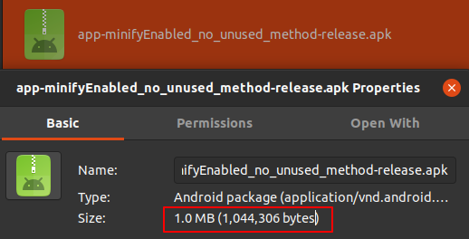

[TOC]

# Android  Proguard

## 代码压缩(shrink code)

在<code>module</code>目录下的<code>build.gradle</code>文件内配置<code>minifyEnabled</code>值为<code>true</code>后，程序代码压缩功能就默认打开了，在打包<code>release</code>版本过程中，Android打包工具会源码进行压缩，移除其中不使用的类，变量，方法等，从而达到缩小最终APK体积的目的。

<!--stackedit_data:
eyJoaXN0b3J5IjpbNTMzNDc0ODc4XX0=
-->